# Tutorial for the use of **pkmodel**

## Basic two compartment model
Import the main model class and the plotter function from **pkmodel**

```python
from pkmodel import PKModel, plot_solution
```

We will also need **numpy** for some operations. We assume these imports throughout the tutorial.

```python
import numpy as np
```

Initialise, then build up model in two steps:
1) create a main compartment with volume 1. Using the standard dosing function (constant dose),
       and the standard elimination function (first order elimination)
2) create a peripheral compartment with volume 0.5 in equilibrium with the main compartment (a sibling)

  **Note**: when setting the time-constants for the main compartment, but we do not want to provide
   and input or an output, we could just set the respective time constants to zero.

```python
two_compartments = PKModel()
two_compartments.create_model("main", 1, dosing_time_constant=1, elimination_time_constant=1)
two_compartments.add_sibling("main", "peripheral", 0.5, connection_time_constant=0.5)
```

Now draw a graph of the network we just created, 
and then plot its solution for a period of 5 time-units, with zero initial concentrations.
The inital conditions need to be an array with length of the total number of compartments.

```python
two_compartments.draw_network()
solution_two_compartments = two_compartments.solve(np.linspace(0,5,1000), np.array([0.0, 0.0]))
plot_solution(solution_two_compartments, two_compartments.get_compartment_names)
```


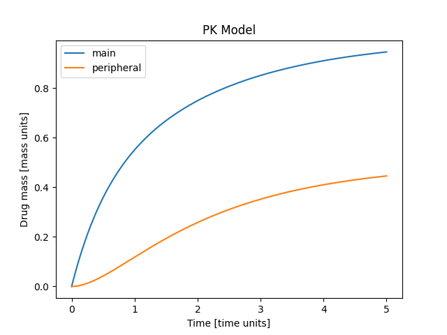

We could also specify a graph title and some units, if the time constants we had chosen
are physically meaningful:

```python
plot_solution(solution_two_compartments, two_compartments.get_compartment_names, title="Intraveneous injection in humans", mass_units="mg", time_units="h")
```

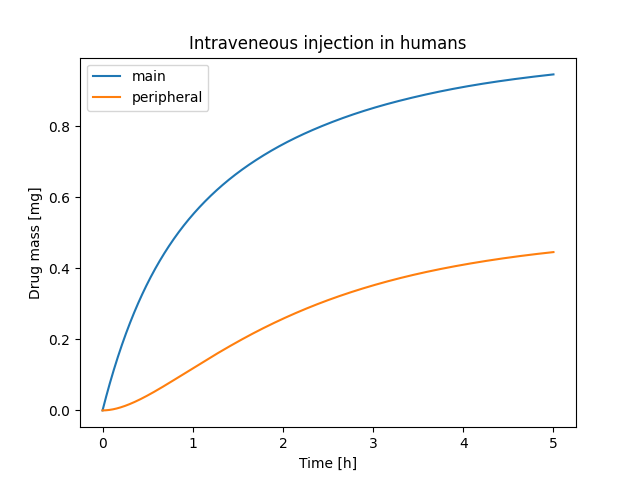

## Using parent compartments

Now suppose we wish to create a model with an additional small pre-compartment (volume 0.1),
with a slow transfer rate into the main compartment, for instance
to represent subcutaneous injection. Note how on adding a parent, the dosing function
is shifted to the new head-node by default.

**Note**: *add_child* works in an analogous way.

```python
three_compartments = PKModel()
three_compartments.create_model("main", 1, dosing_time_constant=1, elimination_time_constant=1)
three_compartments.add_sibling("main", "peripheral", 0.5, connection_time_constant=0.5)
three_compartments.add_parent("main", "subcutaneous", 0.05, connection_time_constant=0.1)

three_compartments.draw_network()
solution_three_compartments = three_compartments.solve(np.linspace(0,5,1000), np.array([0.0, 0.0, 0.0]))
plot_solution(solution_three_compartments, three_compartments.get_compartment_names)
```

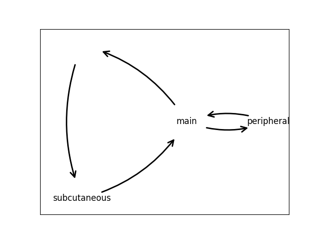
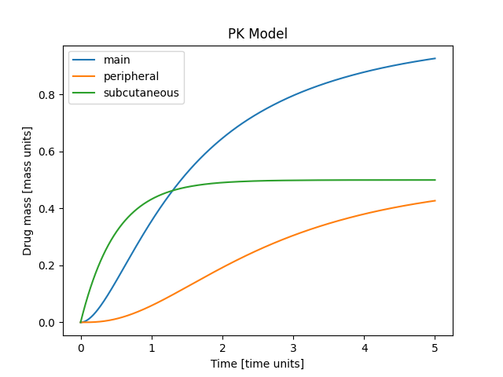

## Using *dose_steady*

Dosing does not be constant. The in-built dose_steady method allows us to specify any time
windows in which a particular dose is applied. Consider for instance 3 
subcutaneous injections of 0.1 time units
separated by 1 time unit each. We can then model how the drug distributes across the main
and peripheral compartments over time.

```python
from pkmodel import dose_steady

multiple_injections = PKModel()
multiple_injections.create_model("main", 1, dosing_func= dose_steady, dosing_time_constant=1, dosing_time_windows= [(0,0.1),(1,1.1),(2,2.2)], elimination_time_constant=1)
multiple_injections.add_sibling("main", "peripheral", 0.5, connection_time_constant=0.5)
multiple_injections.add_parent("main", "subcutaneous", 0.05, connection_time_constant=0.1)

multiple_injections.draw_network()
solution_multiple_injections = multiple_injections.solve(np.linspace(0,8,1000), np.array([0.0, 0.0, 0.0]))
plot_solution(solution_multiple_injections, multiple_injections.get_compartment_names)
```


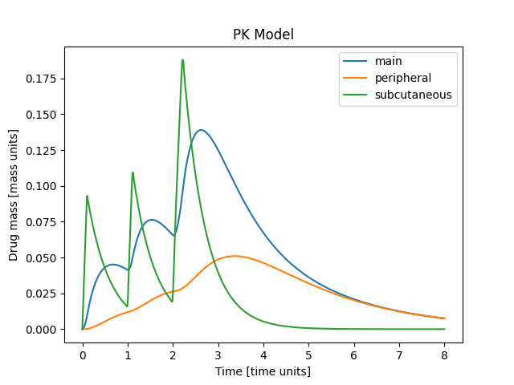

## Custom dosing functions

We can also implement our own dosing protocol and pass it to **pkmodel**. Any custom function
passed to the pkmodel must take two parameters, time *t* and the distribution of mass among compartments *q*. Suppose we would like to implement a cos-shaped dosing protocol on a 
two-compartment system. 

```python
def sin_dosing(t,q):
    return 1 - np.cos(2 * np.pi * t)

sin_two_comp = PKModel()
sin_two_comp.create_model("main", 1, dosing_func=sin_dosing)
sin_two_comp.add_sibling("main", "peripheral", 0.5, connection_time_constant=0.5)

sin_two_comp.draw_network()
solution_sin_two_comp = sin_two_comp.solve(np.linspace(0,8,1000), np.array([0.0, 0.0]))
plot_solution(solution_sin_two_comp, sin_two_comp.get_compartment_names)
```

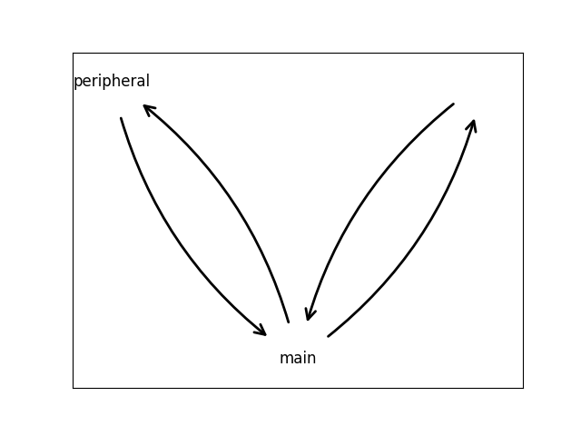
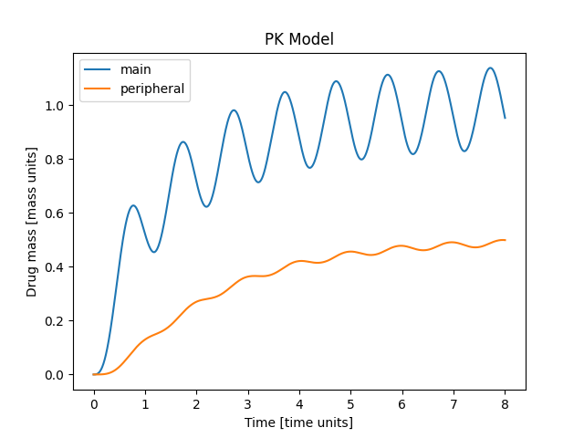

## Multiple in- and outputs

There can be more than one input and output to the system. Suppose we apply one initial strong
dose of a drug to a two-compartment system. The drug is then eliminated via a second-order
loss process from the main compartment, but also via a first order loss process from the
periphercal compartment.

**Note**: *add_input* works analogously.

```python
from pkmodel import first_order, dose_steady

# This sets up the first-order loss process from the peripheral compartment to depend only
# on the peripheral compartment (index 1). Indexes are assigned by order of compertment creation.
peripheral_loss = lambda t, q: first_order(t, q, 0.2, 1)

# The second order loss from the main compartment (note how all in and outputs are written
# with positive signs!):
main_loss = lambda t, q: 0.1 * q[0]**2

double_loss = PKModel()
double_loss.create_model("main", 1, dosing_func=dose_steady, dosing_time_windows=[(0,0.1)], dosing_time_constant=10, elimination_func=main_loss)
double_loss.add_sibling("main", "peripheral", 0.5, connection_time_constant=0.2)
double_loss.add_output("peripheral", peripheral_loss, label="per. loss")

double_loss.draw_network()
solution_double_loss = double_loss.solve(np.linspace(0,10,1000), np.array([0.0, 0.0]))
plot_solution(solution_double_loss, double_loss.get_compartment_names)
```

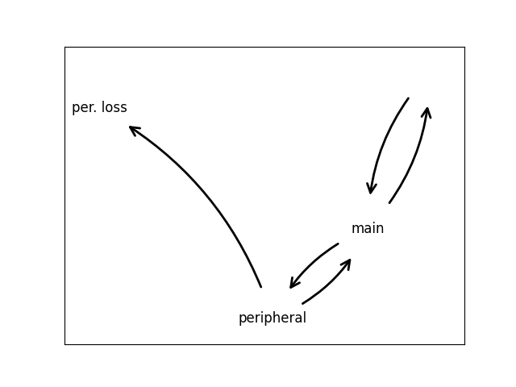
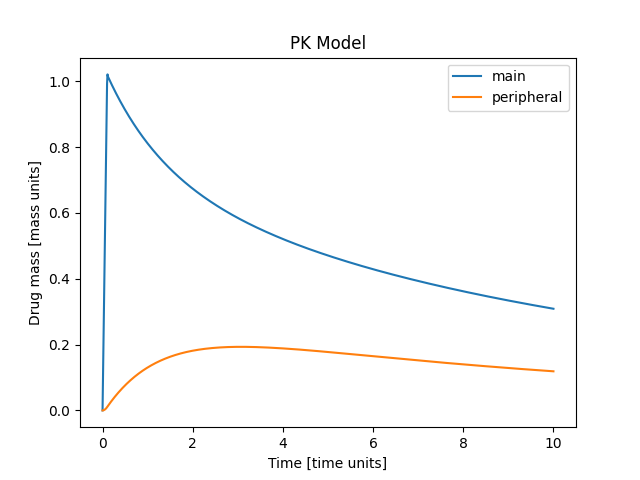

## More complex models

There is no limitation to model complexity. Consider implementing a daily administered dose
subcutaneous dose for 7 days, which acts in a peripheral compartment, but is cleared via the
kidneys, the liver, and the skin. The former two are in equilibrium with the central
compartment, whereas the latter one represents a direct loss process from main.

```python
def periodic_injections(t, q):
    return 1 if np.mod(t,1) < 0.1 and t<8 else 0
def rhenal_clearance(t, q):
    return 0.1 * q[3]
def metabolism(t, q):
    return 0.3 * q[4]

complex_system = PKModel()
complex_system.create_model("main", 1, dosing_func = periodic_injections, elimination_time_constant=0.2)
complex_system.add_sibling("main", "peripheral", 0.5, connection_time_constant=0.5)
complex_system.add_parent("main", "subcutaneous", 0.05, connection_time_constant=0.1)
complex_system.add_sibling("main", "kidney", 3, connection_time_constant=0.2)
complex_system.add_sibling("main", "liver", 1.2, connection_time_constant=0.3)
complex_system.add_output("kidney", rhenal_clearance, label="rh. clear.")
complex_system.add_output("liver", metabolism, label="metab.")

import networkx as nx

# In the current version, this bit is tricky, as for so many compartments we need 
# to use a randomised layout. It will be necessary to play with the networkx parameters for this.
# Also, spring_layout has a random component, so outputs will look different for different runs.
graph_layout = lambda G: nx.spring_layout(G,k=12, iterations=700)

complex_system.draw_network(layout=graph_layout)
solution_complex = complex_system.solve(np.linspace(0,15,100000), np.zeros((5)))
plot_solution(solution_complex, complex_system.get_compartment_names)
```

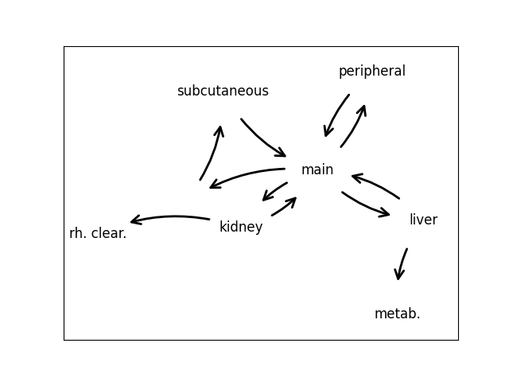
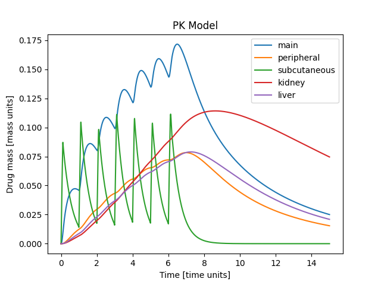